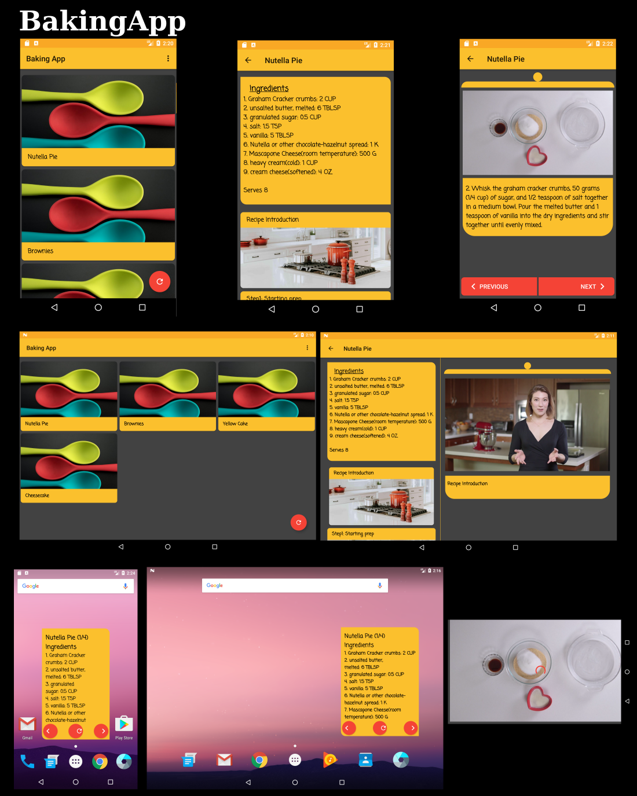

### BakingApp

Enjoy baking with some great recipes and also videos to walk you through. 

The app has different layouts for mobile devices and tabs. You can also try out the widget to show ingredients on your home screen for when you need them close by. This project is part of the Udacity Android Developer Nanodegree program. 

  

 

## Project Overview
Productionize an app, taking it from a functional state to a production-ready state. This involves finding and handling error cases, adding accessibility features, allowing for localization, adding a widget, and adding a library.

## Why this Project?
As a working Android developer, you often have to create and implement apps where you are responsible for designing and planning the steps you need to take to create a production-ready app. Unlike Popular Movies where we gave you an implementation guide, it will be up to you to figure things out for the Baking App.

## What Will I Learn?
In this project you will: 
<ul>
<li>Use MediaPlayer/Exoplayer to display videos.</li>
<li>Handle error cases in Android.</li>
<li>Add a widget to your app experience.</li>
<li>Leverage a third-party library in your app.</li>
<li>Use Fragments to create a responsive design that works on phones and tablets.</li>
</ul>  

Images used in this project were obtained from <a href='https://unsplash.com/'>Unsplash</a>. 

<b>Bake-areful!</b>
